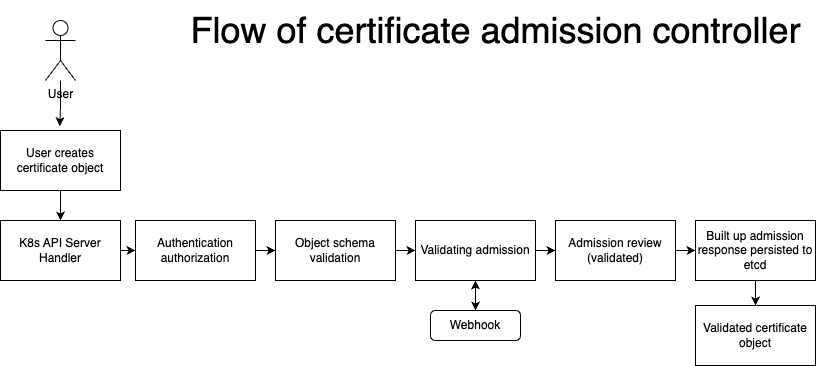

# OpenShift Admission Controller for Certificate Objects

This repository contains an OpenShift Admission Controller specifically designed for handling Certificate objects. The admission controller intercepts requests to create and update Certificate resources and applies custom validation logic before allowing or rejecting the request.

## Introduction

OpenShift Admission Controllers provide a way to enforce validation rules on resources created within an OpenShift cluster. This admission controller focuses on Certificate objects, which are used to configure certificates for services within the 

The admission controller is built and deployed through two webhook configurations. It runs as a separate service and deployment which intercepts requests made to the OpenShift API server related to Certificate resources. By intercepting these requests, the admission controller can modify or validate the Certificate objects before they are persisted to the cluster.

## Features

- Host name and common name are validated so they follow this naming convention: Service-Namespace.apps.ClusterBaseDomain
- DNS name is checked to ensure only 1 entry exists
- DNS name and Common name are checked to ensure they reflect each other



Once the validated certificate object

## Getting started

This command will set up the required configurements such as the deployments, services and roles etc needed for the controller to be deployed.
```
$ oc apply -f configs/ (run twice)
```
The next part of getting started will consist of building your baked image so it can then be injected into the deployment.yaml so it can pull the image and the controller can be set up. The below command builds the image onto the local openshift registry so you will not need to make any changes to the deployment.yaml
```
$ oc new-build --name admission-controller-certificate --binary=true --strategy=docker -n admission-namespace
```
```
$ oc start-build admission-controller-certificate --from-dir=. --follow -n admission-namespace
```
It's worth noting you can build your image and push to an external registry if you wanted, you just need to adjust the image path in the deployment.yaml to reflect the new location of the baked image.
